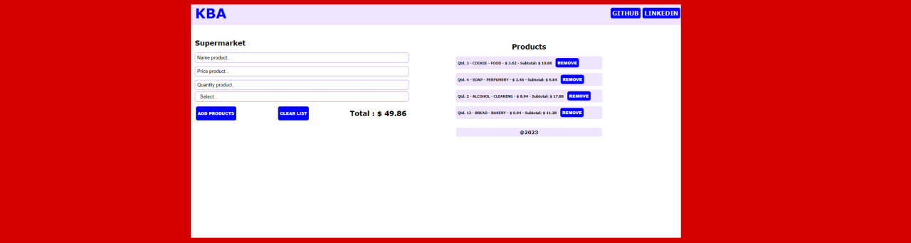
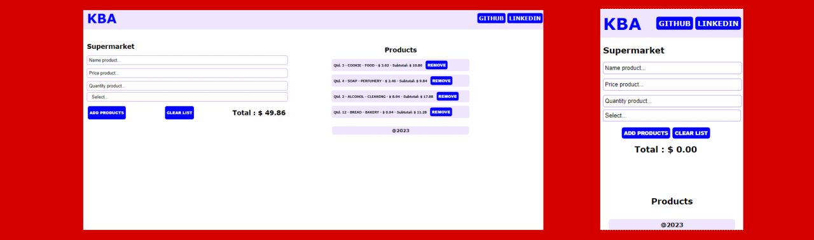

# **Box Supermarket**

## Sobre o projeto

Projeto: [trabalho de javascript](https://javascript-box-supermarket.vercel.app/)

Demonstração de caixa de supermercado, onde o usuário informa os dados dos produtos e eles são adicionados ao carrinho. Os itens do produto são listados e você pode remover um produto ou todos os itens do seu carrinho. Também é possível saber o subtotal e o valor total dos itens.

Demonstration of a supermarket cashier, where the user informs the product data and they are added to the cart. Product items are listed, and you can remove a product or remove all items from your cart. It is also possible to know the subtotal and the total value of the items.

## Layout web e mobile 

## Tecnologias Utilizadas

* HTML 5
* CSS 3
* Javascript
    * Manipulação do DOM (DOM manipulation)
    * Uso de Classes (Using Classes)
    * Uso de Funções (Use of Functions)
    * Evento (Event)
        * Click

## Autor

#### **Katarine Albuquerque**

    
    &nbsp;
    

